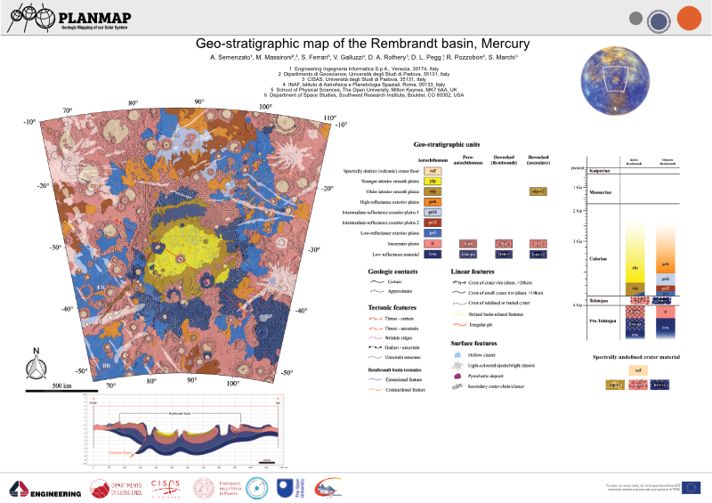
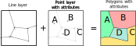

# Geological mapping with GIS tools

**If your are not interested in the theory behind mappy you can skip to the [mappy](mappy.md) tutorial**

This document delineates some useful guidelines and highligths some common problems encountered by mappers when approaching a mapping project, with a special attention to planetary sciences. Although the disciplice is well established the tools used to generate new maps have been progressivly digitized thanks to Geographic information Systems (GIS) software.

There are many GIS software available both commercially and open-source. Open source tools are now extremely mature and can compete with commercial products under many point of views. This  guide is based on QGIS but in large part the same concepts can be ported to your preferred GIS environment.

---

**Note**

Some common open-source GISs are QGIS, GRASS, OpenJump, uDig, SAGA, GVSIG

---


## Geological mapping 

Depending on the scope of the geological survey the cartography can depict different types of content: whether lithostratigrapy, chronostratigrapy, morphology, or other criteria are considered, the building blocks of a geological map is the geological unit, as the base element used to subdivide a region into geologically homogeneous patches of terrain. 



<figcaption> An example of a geological map realized on Mercury </figcaption>


The basic building blocks of a map are the **units**, which are represented with different colors on the map. Each unit is separated from the surrounding ones by lines (contacts). Some key points to keep in mind when realizing a geological map are:

- **Completeness**: no area within the region subject to the mapping can be left unassigned.
- **Limited**: the map should be limited to a specific region, which is defined by an exterior boundary.
- Any number of additional properties can be added on top of the geological map, in the form of linear elements or polygonal shapes (which can exploit either transparency or pattern infilling)

---
**Note**

There are quite a number of predefine infilling patterns and symbology available for geological mapping. The main reference is the [SGS FGDC Standard](https://pubs.usgs.gov/tm/2006/11A02/).

---

## Geological mapping by polygons

Digitized maps are normally represented within GIS software as polygonal layers. Of course polygonal layers are indeed needed to visualize the mapping, making it possible to assign different colors to different units. For this reason many mappers might start a new map by creating a new polygonal layer that she/he will then populate with the different polygons representing the units.

Although this approach seems to perfectly make sense (indeed the final product should be a polygonal layer)  it inherently has several drawbacks:

- the mapper ends up tracing each contacts two times (one for each confining polygon)
- whenever it comes to editing the map the same edits must be exactly replicated two times
- the boundary of the polygons, which represent the contacts, should be stylable (e.g. to represent how much certain we are about a contact). This is not possible when a polygonal representation. The only solution would be to replicate (again!) the contacts as a new line layer that now must be also edited whenever the map is updated.
- the mapper moves much of her/his attention in the polygons generation, rather than in the identification of the contacts. Furthermore, the mapper is forced to define the boundary of each polygon at once, which require to define the contacts between that unit and (potentially) many others surrounding units.  
- polygonal layers render impossible the application of any automated algorithm for map simplification (e.g. to smooth the contacts or even the node distances)

---
**Note**

Polygons-based mapping has a long tradition, and many GIS software offer dedicated editing tools that can alleviate many of these problems, but their correct use is demanded to the user, and not enforced by the data types.

---


## Geological mapping by contacts and points


The solution to these issues might appear rather counterintuitive and require to adopt a different perspective: although the polygonal-layer map is the final product that must be generated it might not be the best format to work on. Indeed, the best solution is to avoid completely the data duplication that is inherent in any polygonal representation.   

To this aim we can treat each geological element for what they really are:

- Contacts are lines and not the (duplicated) boundary between two polygons
- These lines must intersect each other to define valid regions
- The polygons are just the infilling in between the contacts

Starting from these observations it is possible to establish a different methodology for creating a consistent map that does not suffer from all the issues detailed above:

1. Contacts are traced as lines. This also has the benefit to allowing the user to append additional attributes to the lines themselves (i.e. if a contact is more or less certain). To uniquely define a region in the plane the lines just need to intersect each-other. There is no need for precision snapping of the start and end points of the lines. 
2. These contacts can be readily transformed into a polygonal layer by **polygonizing** them. All GISs provide adequate tools for this operation.
3. Attributes for the polygons can then be assigned either manually or using a point layer that labels each defined region. The latter approach allows for a complete and predictable reproducibility of the final product.
4. Any number of different segments can be used to define a single contact (provided they intersect somehow), making it possible to assign different attributes to different portions of the same contact (i.e. if the contact is certain in some parts and uncertain in others). This is especially important for styling the contacts in the final layout. 


<figcaption>Creating maps by using lines and points rather than polygons</figcaption>


This approach is also more similar to the geological reasoning that is performed when mapping, especially when remotely sensed imagery is used (as in planetary mapping): the operator tries to identify the boundaries between different terrains rather than directly defining the area covered by the units themselves. This approach has several advantages:

- No need to employ additional tools to grant the geometric consistency, which is automatically enforced by the data types. Indeed, errors (e.g. not intersecting lines) are readily visible because a polygon would be either missing or aggregated.
- Easy editing. Any time a contact is edited the changes will automatically propagate to all affected polygons. 
- Reusable contacts. Contacts can be reused in map layout and styled to represent different types of contacts. 
- The mapper can solve the contacts working on just two units at a time, rather than having to completely define the boundary of a polygon (which might be in contact with many units).
- The mapping can be performed at progressively finer level of details with no significant efforts: the mapper identify the most relevant units first and then proceed to refine the interpretation just by adding new intersecting lines.

---
**Note**

This approach leads to defining the contacts and label-points layer as the **sources** of a geological map, which can then be transformed to different types (the polygons) for display purposes. Such transformation is predictable and reproducible. This idea suggests that a good and reusable map should indeed also provide these layers to the public rather than just the polygonal ones. Making the map truly upgradable by third parties.

---

These ideas can be easily implemented in any GIS of choice by performing a ```polygonization``` of the contacts and a ```spatial join``` of the points to assign the attributes. If the contacts layer shall be used in the final layout imperfect intersections would leave dangling segments at the end of the lines, which require additional editing. 


